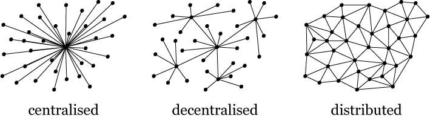

# What is the blockchain

In simple terms, it is a chain of sequential blocks with each block containing some insert-only transaction data, like a ledger.

## Features:

* Decentralised: Distributed ledger, no need for centralised authority.
* Peer-to-peer: All nodes know how to sync with each other intelligently.
* Immutable: Cryptography ensures all transactions are unique and irreversible.
* Secure: Consensus mechanism ensures a compromised node won’t affect the rest of the operation.

Systems can now share data knowing that they have not been tampered and accurate at any point in time. Think of how this property can be important to banks. Imagine you want to transfer money from your Australian Bank to a US Bank. The Australian Bank don’t have to go through many channels to interact with the US Bank. The transaction can occur in the Australian Bank and the full ledger will automatically synced over. Most importantly, it can happen immediately. Think of tracking parcels being send overseas. The parcel movement can be tracked and updated easily without needing specialised software or complex communication between different courier vendors. Think of how middle man like Ebay, facebook, uber, coin exchanges can easily go out of job. The use cases are many. In short, Blockchain streamline processes.

The future is exciting with blockchain technology.

* Blockchain 1.0: Store of value (Cryptocurrency). Eg Bitcoin.
* Blockchain 2.0: Store of value and Smart Contracts (Distributed Apps or DAPPS in short). Eg. Ethereum
* Blockchain 3.0: Store of value, Smart Contracts and Inter-chain Operability.
