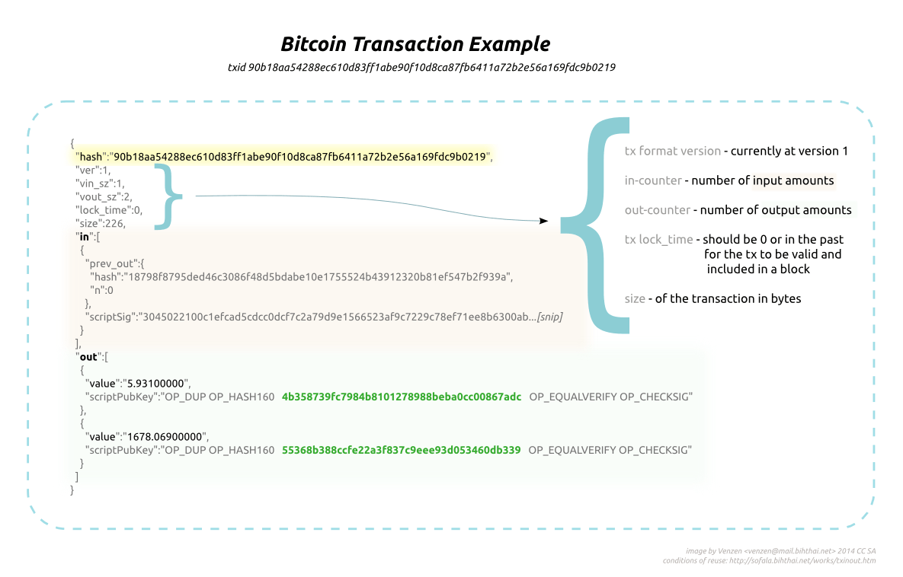

# The blockchain

In simple terms, a blockchain is a chain of sequential blocks with each block containing some insert-only transaction data, like a ledger.

## Features:

* Decentralised: Distributed ledger, no need for centralised authority.

* Peer-to-peer: All nodes know how to sync with each other intelligently.

* Immutable: Cryptography ensures all transactions are unique and irreversible.

* Secure: Consensus mechanism ensures a compromised node won’t affect the rest of the operation.

Systems can now share data knowing that they have not been tampered and accurate at any point in time. Think of how this property can be important to banks. Imagine you want to transfer money from your Australian Bank to a US Bank. The Australian Bank don’t have to go through many channels to interact with the US Bank. The transaction can occur in the Australian Bank and the full ledger will automatically synced over. Most importantly, it can happen immediately. Think of tracking parcels being send overseas. The parcel movement can be tracked and updated easily without needing specialised software or complex communication between different courier vendors. Think of how middle man like Ebay, facebook, uber, coin exchanges can easily go out of job. The use cases are many. In short, Blockchain streamline processes.

The future is exciting with blockchain technology.

* Blockchain 1.0: Store of value (Cryptocurrency). Eg Bitcoin.

* Blockchain 2.0: Store of value and Smart Contracts (Distributed Apps or DAPPS in short). Eg. Ethereum

* Blockchain 3.0: Store of value, Smart Contracts and Inter-chain Operability.

## Inside a Transaction

A simple bitcoin transaction consist of an inputs and outputs. An input consists of the hash of the previous transaction relating to the current address and its public key. The address itself is simply a hash of the public key.

The output consists of the bitcoin addresses of the receiver(s). The wallet would generate another address (change address) for the output if the sender does not send all the bitcoins in one go.

## Combining UTXO Addresses

If you received many small transactions, you might be paying very high tx fees if you want to spend them because they occupy more space in the blocks. Think of it as easier to carry dollar notes around rather that carrying lots of coins.

It is a good idea to combine all the inputs into one especially when the network traffic is low.

In Bitcoin for example, you could do a "Send max" transaction to consolidate all your coins into one of your own addresses in Electrum easily.
