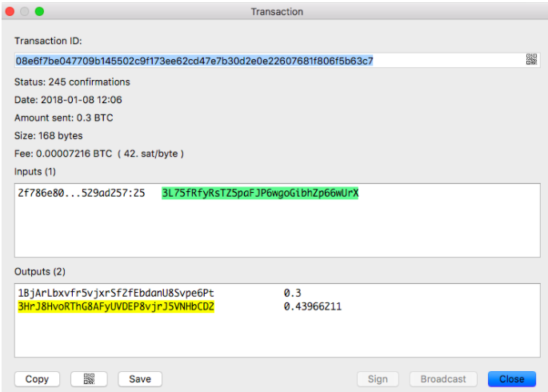

# Basic Bitcoin Concepts

## Blockchain Scaling Problem and Solution

As mentioned previously, Bitcoin’s 7 tx/s is too slow for mass adoption. 

Satoshi Nakamoto did propose a solution:

“One use of nLockTime is high frequency trades between a set of parties. They can keep updating a tx by unanimous agreement. The party giving money would be the first to sign the next version. If one party stops agreeing to changes, then the last state will be recorded at nLockTime. If desired, a default transaction can be prepared after each version so n-1 parties can push an unresponsive party out. Intermediate transactions do not need to be broadcast. Only the final outcome gets recorded by the network.”

So what satoshi was suggesting is that there are only 2 on-chain touch points between 2 parties. The first touch point is when you enter into a locked contract and the second is when you cash out. All intermediate transactions can happen off-chain. It's a bit like linkedin, you don’t have to know anyone in order to trade with them. Indeed, this is how many new scaling technologies operates.

## Soft Fork VS Hard Fork

From gavin andresen’s [note](https://gist.github.com/gavinandresen/2355445):

“Soft" (Soft Fork) changes tighten up the rules - old software will accept all the blocks and transactions created by new software, but the opposite may not be true. "Soft" changes do not require the entire network of miners and merchants and users to upgrade or be left behind. 

"Hard" (Hard Fork) changes modify the rules in a way that old, un-upgraded software consider illegal. At this point it is much, much more difficult (some might say impossible) to roll out "hard" changes, because they require every miner and merchant and user to upgrade.

In other words, Soft fork is simply an upgrade of the chain but Hard fork is creating a new chain based on the old one. The implication of a hard fork is that your wallet in the old chain is automatically ported over to the new chain as well (Free money!). Example of hard forks are Bitcoin Cash, Bitcoin Gold, Bitcoin Diamond, Bitcoin Segwit2x, Ethereum Byzantium….etc. Example of soft fork is the Bitcoin Segwit (not to be confused with Segwit2x).

## Segwit VS Segwit2x

Segwit (Segregated Witness) is a backwards compatible upgrade of the core Bitcoin blockchain. In the current Bitcoin implementation, all transactions are packed in a 1 MB block limit. In a transaction, the digital signature (witness) takes up the most space. The digital signature is the encrypted proof of the sender, receiver and the transaction details, ie who sends how much BTC to who. If we can segregate the signature from each transaction, then we can pack more transactions in each block, thereby increasing transaction speed and reducing transaction fees. The segregated signature lives in a new extended block area and not part of the 1 MB main block.

Another way to pack more tx into a block is to simply increase the block size from 1 MB to something a lot bigger, 8MB or more for example and this is what Bitcoin Cash (BCH) has done.

It is important to note that Traditional Bitcoin address should start with 1 or 3. Segwit address should start with 3 or bc1. See prefixes in [https://en.bitcoin.it/wiki/List_of_address_prefixes](https://en.bitcoin.it/wiki/List_of_address_prefixes) if interested.

The biggest Segwit confusion lies in the definition of Block Size and Block Weight. Since Segwit, block size concept is replaced by [block weight](https://en.bitcoin.it/wiki/Block_weight). Block Size is measured in Bytes and Block Weight is measured in Weight Units (WU). The maximum weight of a 1 MB block is 4000 WU. In calculating the weight of a transaction, a non-witness byte weighs four weight units and a witness byte weighs one weight unit. A non-witness byte weighs four weight units. A witness byte weighs one weight unit.

Take this [Segwit transaction](https://blockchain.info/tx/08e6f7be047709b145502c9f173ee62cd47e7b30d2e0e22607681f806f5b63c7) for example and compare it with [a normal transaction](https://blockchain.info/tx/1c689ae229213eefccb5e1fdbf388d7143906fd907354857bc6da750fe7cd563).

The actual tx size is 249 bytes and it would take up 249 x 4 = 996 WU if its not Segwit. Since it is Segwit, it takes up only 669 WU, meaning the signature (witness) saves the transaction 996 - 669 = 327 WU (32.831% savings).

The same transaction looks differently in the Electrum wallet.

Why is the Size 168 Bytes? If we have to force ourselves to calculate Segwit in bytes, 32.831% savings on 249 Bytes is roughly 168 Bytes. Let’s call 168 Bytes the virtual size so as not to be confused with the raw size of 249 Bytes.

What does all this mean? For a typical Bitcoin transaction of value, you get 33% discount on transaction fee if you use Segwit. *You get bigger discount if your signature is bigger.*

Segwit2x combines Segwit in with a 2MB block size Hard-Fork instead of 1MB, meaning a maximum of 8000 WU. This is a completely new chain and you cannot expect the current Bitcoin blockchain to work with this new chain. Segwit2x fork has happened but its adoption is still unknown at the time of writing.

Here is a [history of Segwit and Segwit2x](https://cointelegraph.com/explained/all-you-need-to-know-about-this-whole-segwit-vs-segwit2x-thing-explained) and [why Bitcoin core opposes Segwit2x](https://cointelegraph.com/news/bitcoin-core-developers-remain-adamant-in-opposition-to-segwit2x-potential-showdown-in-november) if you are interested.

## Why is Segwit not Mass Adopted

There is really no reason not to adopt Segwit. Most exchanges are still using legacy backend (check the Bitcoin address). An exchange is very complex and have a lot of moving parts and upgrading an exchange is very difficult.

Note: Coinbase just implemented Segwit in Feb 2018 and quickly followed by Bitfinex and many others.
