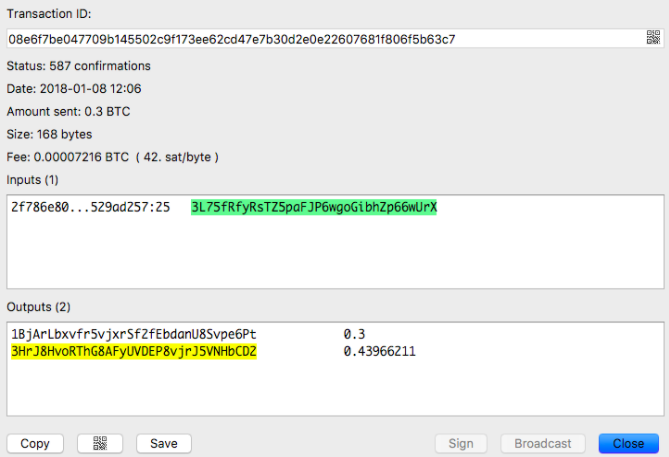

# Handling Stuck Bitcoin Transactions

Bitcoin daemon uses ram to store all pending transactions (mempool). Let’s say Bitcoin mempool default is 300MB and each tx averages 700 bytes. That means it can have a maximum of 428571 pending txs.

In theory, a transaction could be stuck in the mempool forever if it does not have enough tx fee. We could save the stuck tx by accelerating it.

## Bitcoin Transaction Acceleration Explained

These are 3 common techniques for Bitcoin wallets to accelerate transactions:

a) Child pays for parent (CPFP)

Spending an unconfirmed transaction will cause miners to consider confirming the parent transaction in order to get the fees from the child transaction included in the same block. This is the technique used by Ledger Nano wallet app. Consider [this transaction](https://blockchain.info/tx/08e6f7be047709b145502c9f173ee62cd47e7b30d2e0e22607681f806f5b63c7):

The transaction was sent with a tx fee of 42 sat/byte. This is a very low fee by today’s standard. Normal fee should be around a few hundred sat/byte if you check https://estimatefee.com/. In this transaction, the output 3HrJ8HvoRThG8AFyUVDEP8vjrJ5VNHbCD2 (the same wallet as the input) would be unspent. We can force the miner to mine this transaction by spending it with a higher tx fee, ie by creating [another transaction](https://blockchain.info/tx/30ac974c612099e464463b4018d03ef856ae1a3f9a83a680f48e5a37dbdceee8).

Note that the output of the previous transaction is now the input of the new transaction. The only difference is now with a higher tx fee, ie 282 sat/byte.

b) Replace-by-fee(RBF)

Transactions spending the same coin to the same addresses are not considered double-spends by the network and are still relayed, as long as they pay a higher fee than the preceding transaction. This is the technique used by the Electrum wallet.

In the Electrum wallet for example, you simply need to check the “Replaceable” option to activate the RBF feature in case you need to resend the tx with a higher fee at a later point.

c) Manual Acceleration

If you are sending bitcoin from your exchange account and you cannot set the tx fee, the only way to accelerate the tx is to ask miners to accelerate it for you. Some popular ones are:

https://pushtx.btc.com/ (paid service and very expensive)

https://viabtc.com/tools/txaccelerator/ (free but unstable)

As accelerating transactions is popular especially when the traffic is heavy, there are also many scammers who claim they can do it at a much lower price. At the time of writing, 80% of most exchanges support ticket are traffic related. Some bitcoin transactions are stuck in the mempool (pending) for more than a week! Until we can [scale the blockchain](https://blockgeeks.com/guides/blockchain-scalability/), mass adoption can be slow.

[https://btc.com/stats/unconfirmed-tx](https://btc.com/stats/unconfirmed-tx) gives you a good idea of the Bitcoin traffic.

If you get confused with the satoshi unit of measurement, [http://btcsatoshi.com](http://btcsatoshi.com) can help you to calc tx fees in satoshi really quickly. In short, 1 satoshi = 0.00000001 btc (8 decimal places)

Tip: Some people also find rebroadcasting the transaction useful in getting a tx unstuck. To do that, go to https://blockchain.info/tx/your_tx?format=hex. Copy the values and paste it in https://blockchain.info/pushtx. 